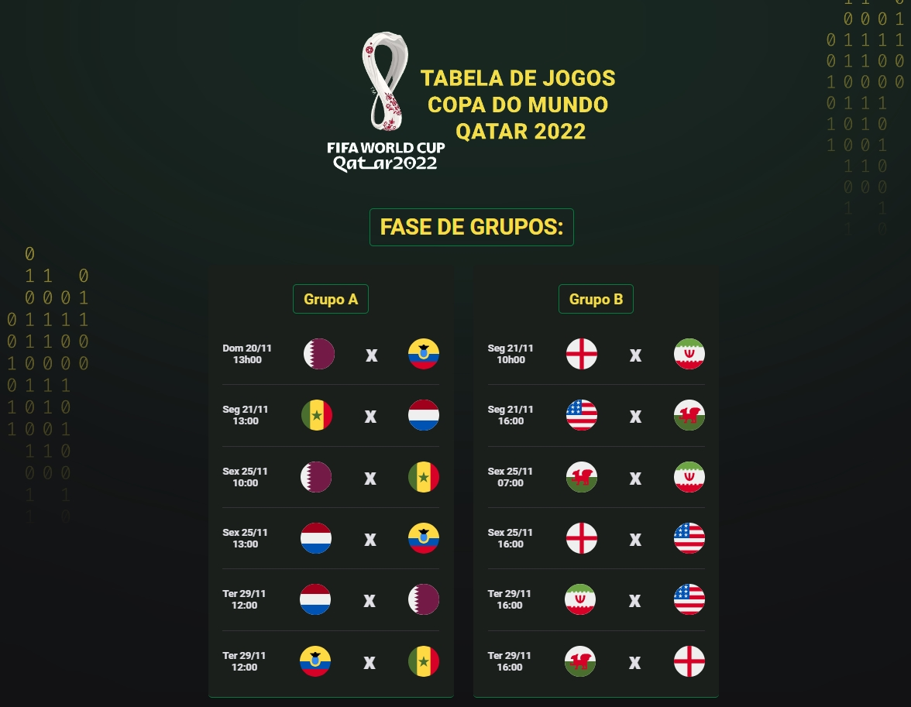

# Tabela Copa do Mundo 2022

Projeto construído como desafio pessoal a partir do evento Next Level Week (NLW) da Rocketseat.

[📎 Clicando aqui você pode acessar esse projeto!](https://bfalconi.github.io/tabela-copa)

## 💻 Tecnologias

- HTML
- CSS
- JavaScript
- Git e Github

## 💻 Layout

Você pode visualizar o layout base do projeto através desse [link](https://www.figma.com/file/HrIaQbqencptEBH7yqi5ft/Calend%C3%A1rio-de-Jogos-(Community)?node-id=0%3A1). É necessário ter conta no Figma para acessá-lo.

## 📝 Projeto

É um projeto que apresenta a tabela da Copa do Mundo de 2022, contemplando os jogos, datas e horários. O projeto ainda está em desenvolvimento, com perspectiva de serem adicionados os resultados da fase de grupos, bem como construção das oitavas de final em diante.

## 📩 Contato

dgabrielfalconi@gmail.com